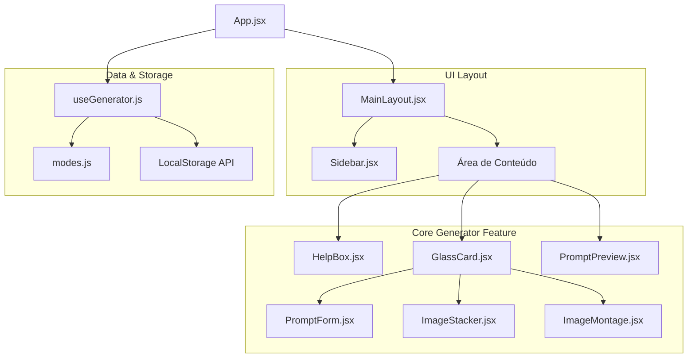

# 📘 Documentação do Sistema - FlowPrompt

Bem-vindo à documentação oficial do **FlowPrompt**. Este guia técnico destina-se a engenheiros de software, designers de interface e desenvolvedores de inteligência artificial interessados em compreender a fundo o design, a engenharia e o fluxo de dados da ferramenta de geração de prompts de alta fidelidade para os modelos **Google Veo** (vídeo) e **Google Nano Banana** (imagem).

---

## 1. Sumário Executivo

O **FlowPrompt** é uma aplicação web interativa de alta fidelidade projetada para preencher a lacuna entre a complexidade de formular prompts profissionais e os criadores de conteúdo. Os modelos generativos de ponta do Google — como o **Veo 3.1** (para geração de vídeos com física consistente, movimentos de câmera e dublagem labial ativa) e o **Nano Banana 2** (para imagens estáticas hiper-realistas) — exigem instruções ricas, estruturadas e semânticas para produzir resultados ideais. 

A plataforma automatiza a construção de prompts aplicando **fórmulas de engenharia narrativa**. Ao invés de o usuário ter que recordar a terminologia exata de composição fotográfica ou movimentos de câmera, o sistema orienta o preenchimento de campos específicos e insere, por padrão, metatransições e "tokens de ouro" de fidelidade técnica.

### Objetivos do Sistema
- **Padronização:** Garantir que todos os prompts gerados obedeçam a estruturas ideais de iluminação, enquadramento e temporalidade.
- **Engajamento e Viralização:** Modos voltados a mídias sociais (TikTok e Reels) com ganchos de retenção dinâmicos de 2 segundos, SFX imersivo e diretrizes de dublagem labial.
- **Experiência de Uso Fluida:** Interface responsiva, com visual futurista e flutuante (*glassmorphism*), atalhos de autocompletar e preenchimento randômico para desbloquear a criatividade.
- **Zero Atrito Local:** Funcionalidades de processamento e diagramação de imagens integradas rodando no lado do cliente (via HTML5 Canvas), eliminando custos de infraestrutura de servidor.

---

## 2. Visão Geral da Arquitetura

O sistema é construído sobre uma arquitetura moderna SPA (Single Page Application) rodando **React 19** e empacotado pelo **Vite 6**. O design arquitetural prioriza a separação estrita de interesses (Separation of Concerns), dividindo a aplicação em componentes reutilizáveis, layouts globais e a lógica de negócios encapsulada em hooks customizados.

### Diagrama Conceitual de Componentes



### Estrutura de Diretórios e Fronteiras do Sistema
O ecossistema de arquivos do FlowPrompt é dividido de forma modular:

*   **Ponto de Entrada:** [main.jsx](file:///d:/dev/flowprompt/src/main.jsx) inicializa a renderização do React 19.
*   **Orquestrador:** [App.jsx](file:///d:/dev/flowprompt/src/App.jsx) atua como o controlador central, conectando os estados exportados pelo hook `useGenerator` aos elementos visuais.
*   **Layout:** [MainLayout.jsx](file:///d:/dev/flowprompt/src/layouts/MainLayout.jsx) e seu respectivo módulo de estilo [MainLayout.module.css](file:///d:/dev/flowprompt/src/layouts/MainLayout.module.css) determinam o grid de duas colunas em telas de desktop e o comportamento responsivo de gaveta (drawer) em dispositivos móveis.
*   **Lógica de Negócios (State & Logic):** [useGenerator.js](file:///d:/dev/flowprompt/src/features/generator/hooks/useGenerator.js) centraliza o gerenciamento dos estados do formulário, as ações de persistência do histórico e favoritos no navegador, bem como a compilação reativa das strings de prompt.
*   **Constantes (Fórmulas e Configurações):** [modes.js](file:///d:/dev/flowprompt/src/features/generator/constants/modes.js) atua como a base de dados do sistema, contendo todas as definições de campos, fórmulas matemáticas de prompt, placeholders, ajudas interativas e chips de autocompletar.
*   **Componentes de UI de Propósito Geral:** Localizados em `src/components/ui/`, fornecem os blocos fundamentais de estilização como [GlassCard.jsx](file:///d:/dev/flowprompt/src/components/ui/GlassCard.jsx) (cartão com efeito acrílico translúcido) e [HelpBox.jsx](file:///d:/dev/flowprompt/src/components/ui/HelpBox.jsx) (caixa de ajuda com tema contextualizado).

---

## 3. Decisões de Design (Design Decisions)

Durante o desenvolvimento do FlowPrompt, diversas escolhas estratégicas de arquitetura e design de produto foram adotadas para garantir o alto desempenho e o encantamento do usuário final:

### 3.1. Estética Premium e Fluidez Espacial (*Glassmorphism*)
Para competir com interfaces modernas e atrair o público criativo e de marketing de mídias sociais, o FlowPrompt rejeita cores básicas e layouts monótonos.
*   **Aparência Translúcida:** Utiliza efeitos de `backdrop-filter: blur(16px)` aliados a bordas semitransparentes finas (`border: 1px solid rgba(255, 255, 255, 0.08)`) para dar uma sensação física de camadas de vidro flutuantes sob um fundo escuro espacial (#0a0a12).
*   **Micro-Animações:** Implementa a biblioteca **Framer Motion** para animar transições de guias no formulário, abertura e fechamento de modais ou gavetas móveis e o feedback de "Copiado!" de forma suave e orgânica.
*   **Tipografia Aprimorada:** Carrega a fonte **Outfit** do Google Fonts para títulos e textos elegantes e modernos, e **JetBrains Mono** para o bloco de texto de código onde o prompt é exibido, transmitindo precisão e facilidade de leitura técnica.

### 3.2. Arquitetura Orientada a Configuração (Schema-Driven UI)
Em vez de codificar formulários estáticos separados para cada modelo de inteligência artificial (Veo, Nano Banana, Interpolação), o sistema foi concebido de forma genérica.
*   O componente [PromptForm.jsx](file:///d:/dev/flowprompt/src/features/generator/components/Form/PromptForm.jsx) lê a matriz `fields` declarada no arquivo de configuração do modo atual.
*   O formulário renderiza em tempo de execução o tipo correto de elemento de interface correspondente (`text`, `textarea`, `info` ou `select`) e popula dinamicamente os chips de sugestão interativos. Isso permite adicionar novos modelos ou alterar campos inteiros em minutos apenas modificando o arquivo [modes.js](file:///d:/dev/flowprompt/src/features/generator/constants/modes.js), sem tocar no código de UI.

### 3.3. Processamento no Lado do Cliente (Zero Servidor)
Os recursos avançados como o **Pinterest Image Stacker** e o **Image Montage Grid** exigem o carregamento e junção de dezenas de megabytes de imagens dos usuários.
*   **A Solução Canvas HTML5:** Ambas as ferramentas foram projetadas para processar, cortar, dimensionar e montar as colagens diretamente no navegador do cliente usando Canvas 2D.
*   **Resultado:** Isso garante privacidade absoluta dos arquivos de imagem do usuário (que nunca sobem para a internet), tempo de processamento instantâneo (sem lag de upload) e custo zero de infraestrutura e hospedagem de servidores para o administrador da plataforma.

---

## 4. Componentes do Núcleo (Core Components)

### 4.1. `useGenerator.js` (O Motor Lógico)
Localizado em [useGenerator.js](file:///d:/dev/flowprompt/src/features/generator/hooks/useGenerator.js), este hook é o centro nervoso do gerador. Ele implementa os seguintes estados e comportamentos reativos:

*   **`currentModeId` & `currentMode`:** Controla o modelo de IA selecionado pelo usuário e expõe de forma reativa os campos e fórmulas desse modo específico.
*   **`formValues`:** Um dicionário dinâmico `{ [fieldId]: value }` sincronizado com os inputs de formulário.
*   **`generatedPrompt`:** Uma propriedade computada via `useMemo` que executa a função de fórmula descrita em `modes.js`, injetando de forma reativa os valores atuais e provendo fallbacks inteligentes do tipo `<<< Campo >>>` se o campo estiver vazio para manter o usuário consciente da estrutura geral.
*   **Histórico Inteligente (History):** Mantém uma pilha persistente no LocalStorage contendo os últimos 20 prompts que o usuário copiou com sucesso. Ele previne adições consecutivas duplicadas e registra o carimbo de data/hora exato.
*   **Favoritos (Favorites):** Permite curar e armazenar permanentemente os melhores prompts e configurações de variáveis que o criador gerou.
*   **Ação de Restauração (`loadSavedItem`):** Um dos maiores diferenciais de produtividade da plataforma. Ao clicar em um cartão do histórico ou favoritos na barra lateral, essa função muda instantaneamente o `currentModeId` para o modo original do prompt salvo e repopula todos os campos de entrada do formulário com os valores guardados de forma imediata.

```javascript
// Exemplo prático da compilação do prompt do Veo 3.1 no hook
const generatedPrompt = useMemo(() => {
  if (currentMode.isAbout || !currentMode.formula || !currentMode.fields) return '';
  
  const displayValues = {};
  currentMode.fields.forEach(field => {
    displayValues[field.id] = formValues[field.id]?.trim() || `<<< ${field.label} >>>`;
  });
  
  return currentMode.formula(displayValues);
}, [currentMode, formValues]);
```

### 4.2. `PromptForm.jsx` (Formulário Dinâmico)
O arquivo [PromptForm.jsx](file:///d:/dev/flowprompt/src/features/generator/components/Form/PromptForm.jsx) renderiza os campos baseados no esquema do modo atual.
*   **Chips de Sugestão Inteligentes:** Renderiza pequenos botões interativos para cada campo. Clicar em um chip executa `onAddSuggestion`, que adiciona inteligentemente o termo ao final do texto já existente (separado por vírgula) sem apagar o texto digitado pelo usuário.
*   **Datalist Integrada:** Para acelerar a digitação, os mesmos termos dos chips são injetados em uma tag `<datalist>` do HTML5, permitindo autocompletar diretamente no input do teclado.
*   **Prompts Rápidos Virais:** Um painel exclusivo para os modos de vídeo (`video-from-img` e `video-from-frames`) que permite copiar instantaneamente prompts virais altamente otimizados ("IA Decide + Falas", "IA Decide + SFX", etc.) onde o motor de vídeo do Google Cloud tem total autonomia de movimento de câmera e física, mas segue restrições rígidas de fidelidade de iluminação e consistência temporal.

### 4.3. `Sidebar.jsx` (Central de Comando)
Localizado em [Sidebar.jsx](file:///d:/dev/flowprompt/src/features/generator/components/Sidebar/Sidebar.jsx), este componente organiza a barra lateral em três abas de navegação principal:
1.  **Modelos:** Uma lista visual que muda instantaneamente o gerador ativo.
2.  **Histórico:** Exibe cartões dos prompts gerados recentemente no LocalStorage. Cada cartão possui um atalho para copiar de novo o prompt final com um clique, favoritar ou restaurar o estado do formulário inteiro.
3.  **Favoritos:** Uma lista dedicada das melhores gerações do usuário.

### 4.4. `ImageStacker.jsx` (Pilha de Imagens Pinterest)
A ferramenta [ImageStacker.jsx](file:///d:/dev/flowprompt/src/features/generator/components/ImageStacker/ImageStacker.jsx) permite a criadores de mídia social empilhar várias fotos verticalmente em um único pin longo do Pinterest.
*   **Reordenação Arrastar-e-Soltar:** Utiliza o componente `<Reorder.Group>` do Framer Motion para permitir ao usuário reorganizar as fotos de forma altamente fluida e interativa no eixo Y.
*   **Ajuste Inteligente de Canvas:** Redimensiona todas as imagens importadas para uma largura padrão de `1000px` (mantendo a proporção original de cada foto para evitar distorções) e calcula a altura total do canvas dinamicamente somando a altura proporcional de cada imagem ao espaçamento pixel (gap) definido no controle deslizante (slider).
*   **Formatos flexíveis:** Exporta o arquivo final diretamente em `PNG` de alta qualidade ou `JPEG` otimizado.

### 4.5. `ImageMontage.jsx` (Montagem Personalizada de Imagens)
O utilitário [ImageMontage.jsx](file:///d:/dev/flowprompt/src/features/generator/components/ImageMontage/ImageMontage.jsx) resolve a necessidade de criar montagens de grade lado a lado (ex: 2x2, 3x3) para mashups visuais.
*   **Layout Adaptativo:** O usuário controla o número exato de colunas (de 1 a 5), espaçamento (gap) em pixels e a cor exata da borda (através de um seletor de cores HTML5 ou inserindo o código hexadecimal hexadecimal).
*   **Modos de Encaixe:**
    *   **Preencher (Cover):** Executa cálculos de corte geométrico no Canvas para centralizar e esticar cada foto até ocupar a célula inteira da montagem de forma simétrica.
    *   **Ajustar (Contain):** Mantém a foto inteira visível dentro da célula, preenchendo as laterais ou topo com a cor da borda de fundo escolhida.
*   **Reordenação Horizontal:** Utiliza reordenação baseada no eixo X para mover e priorizar a ordem de renderização das imagens na grade.

---

## 5. Modelos de Dados e Fórmulas de Prompt

O coração estético dos prompts profissionais gerados pelo FlowPrompt repousa sobre as fórmulas construídas no arquivo [modes.js](file:///d:/dev/flowprompt/src/features/generator/constants/modes.js). Abaixo detalhamos as principais fórmulas ativas:

### 5.1. Modo: Vídeo Novo (Veo)
*   **ID:** `video-new`
*   **Fórmula:**
    ```javascript
    (vals) => {
      let prompt = `A professional, cinematic video sequence shot with ${vals.cinematography}. The focus is on ${vals.subject} as they are ${vals.action}. The setting is a detailed ${vals.context}, carefully composed to highlight the depth of the scene. The visual aesthetic is ${vals.style_ambiance}, rendered in high resolution with realistic textures and fluid motion.`;
      
      if (vals.characters_definition && vals.characters_definition.trim() !== '') {
        prompt += ` Character details: ${vals.characters_definition}.`;
      }

      if (vals.dialogue && vals.dialogue.trim() !== '') {
        prompt += ` During the sequence, the characters speak the following dialogue using the format [character]: [speech] with perfect lip-sync natively in Brazilian Portuguese (pt-BR): "${vals.dialogue}".`;
      }
      
      return prompt;
    }
    ```

### 5.2. Modo: Interpolação Viral de 2 Frames (Veo)
Este modo otimiza transições fluidas e dinâmicas de 2 imagens fornecidas para o TikTok/Reels, com foco em física consistente e retenção.
*   **ID:** `video-from-frames`
*   **Fórmula:**
    ```javascript
    (vals) => {
      let prompt = `Using the start frame and end frame as structural guides, animate a high-fidelity, seamless transition optimized for vertical social media.`;
      
      if (vals.visual_quality && vals.visual_quality.trim() !== '') {
        prompt += ` Technical quality: ${vals.visual_quality}.`;
      } else {
        prompt += ` Technical quality: hyper-realistic, 8k resolution, cinematic lighting, masterfully executed.`;
      }

      if (vals.object_interaction && vals.object_interaction.trim() !== '') {
        prompt += ` Key transition event and magic interaction: ${vals.object_interaction}.`;
      }

      if (vals.initial_hook && vals.initial_hook.trim() !== '') {
        prompt += ` Main action and retention hook: ${vals.initial_hook}.`;
      } else {
        prompt += ` The characters perform a natural and fluid motion to connect the two poses.`;
      }

      prompt += ` The environment remains perfectly consistent with the provided frames.`;

      if (vals.general_notes && vals.general_notes.trim() !== '') {
        prompt += ` Tone and atmosphere: ${vals.general_notes}.`;
      }

      prompt += ` Dynamic camera: ${vals.camera_motion || 'Smooth cinematic movement'}.`;

      if (vals.characters_definition && vals.characters_definition.trim() !== '') {
        prompt += ` Visual identity details: ${vals.characters_definition}.`;
      }

      if (vals.sound_effects && vals.sound_effects.toLowerCase() !== 'no audio' && vals.sound_effects.toLowerCase() !== 'sem som') {
        prompt += ` SFX: ${vals.sound_effects}.`;
      }
      
      if (vals.dialogue && vals.dialogue.trim() !== '') {
        prompt += ` Dubbing: The characters speak the following dialogue with perfect lip-sync in Brazilian Portuguese (pt-BR): "${vals.dialogue}". Use the format [character]: [speech].`;
      }
      
      prompt += ` Ensure extreme temporal consistency, fluid physics, and no sudden cuts.`;
      
      return prompt;
    }
    ```

---

## 6. Integração e Ciclo de Dados (Data Flow)

O fluxo de dados da aplicação ocorre sob o fluxo clássico unidirecional do React, impulsionado pela persistência no lado do cliente:

```
[Ação do Usuário] 
    │ (Digita num campo / clica num chip / clica em Randomize)
    ▼
[Atualização de Estado: formValues] 
    │ (Desencadeia o ciclo de re-render reativo no useGenerator)
    ▼
[Compilação Computada: useMemo(generatedPrompt)] 
    │ (Aplica a fórmula associada ao currentModeId no modes.js)
    ▼
[Preview na UI & Ação Copiar]
    │ (Usuário clica em Copiar no PromptPreview)
    ▼
[Adição no Histórico & Sincronização LocalStorage]
    │ (O hook adiciona o item ao estado 'history' e grava no localStorage)
    └─► [Pronto para Restauração Retroativa posterior]
```

### Análise de Persistência no Navegador
Para salvar e resgatar o histórico e favoritos sem exigir um servidor de banco de dados ou autenticação de usuário (garantindo velocidade total de carregamento e privacidade local de propriedade intelectual), o FlowPrompt utiliza a **Web Storage API (LocalStorage)**.

1.  **Armazenamento de Histórico:** O array de histórico é inicializado ao ler a chave `flowprompt_history`. Caso não exista, assume um array vazio `[]`.
2.  **Sincronização reativa (Efeitos colaterais):** Dois blocos de `useEffect` monitoram reativamente qualquer alteração nos estados `history` ou `favorites` e reescrevem de forma serializada em string JSON os novos dados no armazenamento local instantaneamente.
3.  **Segurança e Limite de Pilha:** Para evitar saturar a cota de 5MB do LocalStorage do navegador, a pilha de histórico recente é cortada rigidamente no limite de **20 itens** (`HISTORY_LIMIT = 20`) através do método JavaScript `.slice(0, HISTORY_LIMIT)`.

---

## 7. Arquitetura de Implantação (Deployment Architecture)

O projeto está otimizado para o modelo de **Jamstack moderno**, rodando sob um pipeline de implantação contínua (CI/CD) conectado à plataforma global da **Vercel**.

### Pipeline de Deploy Contínuo (CI/CD)
1.  **Commit / Push:** O desenvolvedor realiza uma alteração no código e envia para o repositório central no GitHub (`rmgimenez/flowprompt`).
2.  **Build Automático da Vercel:** O webhook da Vercel detecta a atualização, provisiona uma máquina virtual efêmera de build e executa:
    ```bash
    pnpm build
    ```
3.  **Compilação Vite:** O compilador Vite realiza o "tree-shaking" (eliminação de código morto das bibliotecas importadas) e o empacotamento estático de alta compressão (arquivos JS e CSS minificados com "hash" no nome na pasta `/dist`).
4.  **Integração Vercel Analytics:** O script `@vercel/analytics` injeta relatórios de desempenho e tráfego diretamente no lado do cliente com total conformidade com a LGPD e GDPR, permitindo ao administrador analisar visualizações e conversão do site em tempo real.

---

## 8. Características de Performance

O FlowPrompt implementa padrões rigorosos de performance no React 19 para evitar latência da interface e garantir interações de 60fps constantes mesmo em dispositivos móveis menos potentes:

### 8.1. Otimização de Processamento de Fórmulas (`useMemo`)
*   **Problema:** A compilação da string final do prompt é executada com base em funções de string que varrem todo o array de campos do modo selecionado. Se essa compilação rodasse em toda e qualquer re-renderização do componente de aplicativo (por exemplo, ao abrir ou fechar o menu móvel), ocorreria perda de taxa de quadros (lag).
*   **Solução:** O valor `generatedPrompt` é envolvido em um `useMemo` com dependências estritas de `[currentMode, formValues]`. O cálculo do prompt só é disparado quando os dados específicos do formulário mudam.

### 8.2. Prevenção de Flutuações Dinâmicas de UI
*   **Problema:** No formulário, o componente de botões de chip exibe 5 sugestões aleatórias para os usuários não ficarem sobrecarregados com dezenas de opções na tela ao mesmo tempo. Se a ordenação randômica dos chips ocorresse em todo ciclo de renderização comum (ex: a cada letra que o usuário digita no teclado dentro de qualquer input), os botões iriam tremer e mudar de posição continuamente na tela, destruindo a usabilidade.
*   **Solução:** O formulário implementa o hook `useMemo` na propriedade `displaySuggestions`. A ordenação randômica de sugestões é travada e memorizada com base na dependência exclusiva de `[fields]`. Os chips só mudam de conteúdo e posição quando o usuário altera fisicamente o modelo de IA selecionado, permanecendo estáveis enquanto o usuário está ativamente preenchendo o formulário.

---

## 9. Modelo de Segurança

O FlowPrompt adota o princípio de **Privacidade por Design (Privacy-by-Design)**. A segurança do sistema é robusta devido à sua arquitetura descentralizada no lado do cliente:

*   **Privacidade dos Dados do Usuário:** Não há banco de dados na nuvem que armazene as fotos carregadas pelos usuários para fazer montagens ou empilhamentos Pinterest. O Canvas executa inteiramente local, o que anula qualquer vazamento de dados de arquivos privados.
*   **Proteção de Ideias de Prompt (IP):** Os prompts gerados e salvos no histórico ou favoritos nunca são transmitidos para um servidor web centralizado. Eles residem unicamente no LocalStorage do próprio dispositivo físico do usuário, garantindo segredo total sobre as estratégias de marketing do criador.
*   **Ausência de Credenciais:** A aplicação não armazena chaves de API da IA do Google AI Studio ou do OpenRouter na nuvem. A ferramenta é um gerador de instruções; o usuário é quem insere o prompt final manualmente nas ferramentas oficiais de geração que já possuem suas contas autenticadas. Isso remove qualquer superfície de ataque relacionada a roubo de créditos ou vazamento de chaves de API.

---

## 10. Apêndice

### 10.1. Glossário de Termos Cinematográficos e Fotográficos Utilizados
O FlowPrompt expõe diversos termos técnicos de audiovisual recomendados nos guias do Google Cloud. Abaixo estão suas definições operacionais no sistema:

*   **Dolly Zoom (Efeito Vértigo):** Movimento onde a câmera avança ou retrocede fisicamente enquanto a lente realiza um zoom na direção oposta, distorcendo a percepção de fundo e criando uma forte sensação de suspense ou revelação dramática.
*   **POV Shot (Point of View):** Vista em primeira pessoa, onde a lente simula os olhos do sujeito, ideal para imersão total do público.
*   **Rack Focus (Foco Alternado):** Ação de mudar o foco focal de um objeto em primeiro plano para outro em segundo plano durante a mesma tomada, orientando o olhar do espectador de forma elegante.
*   **Dutch Angle (Plano Holandês):** Câmera levemente inclinada para o lado, transmitindo instabilidade, mistério, dinamismo ou estranheza na cena.
*   **Unreal Engine 5 Render:** Um dos termos ("tokens de ouro") mais fortes para instruir a inteligência artificial a simular renderização em tempo real de nível profissional, com física complexa de luz indireta, detalhes microscópicos de textura e micro-detalhes têxteis/pele.

### 10.2. Contato do Criador e Licenciamento
*   **Autor:** Ricardo Moura Gimenez
*   **E-mail:** [rmgimenez@gmail.com](mailto:rmgimenez@gmail.com)
*   **Licença:** MIT (Livre para uso pessoal e comercial, modificação e distribuição de derivados desde que mantidos os devidos créditos originais).

---
> [!NOTE]
> Esta documentação técnica reflete o estado atual do repositório FlowPrompt e serve como manual oficial para integração contínua e treinamento de novos desenvolvedores envolvidos no projeto.
